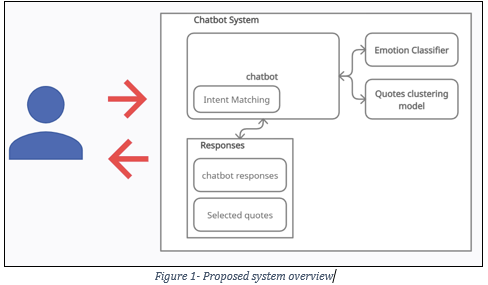

# Emotion based chat bot

## Description:
A custom chatbot implementation is proposed that will respond to the user ‘s input either according to the detected emotion or with a quote that is close to the user’s input messages.

## Problem Formulation
Life is stressful and we all find ourselves sometimes in dark places, needing someone to talk to and share our feelings.  Sometimes we can’t find a person to talk to, but we always have our phones on our hands. for these reasons, a chatbot that will assess the current user’s input text emotion and respond accordingly to improve the users’ mood would definitely ease the users’ feelings. For example, If the user is feeling depressed the chatbot should suggest positive activities or send positive messages to make the user’s feel better. The proposed system is inspired by this paper

### The system overview is as presented in the following graph

   

## Datasets
The following datasets were used to build the system:

- Emotions dataset

   A dataset contains a collection of documents and their emotions and is available on Kaggle in this link. 

- Quotes dataset

   A dataset that contains a big collection of quotes with their authors, category, tags, and popularity. It is available on Kaggle in this link. 

- Bot responses dataset

   A small dataset that was collected by searching the internet manually for appropriate responses for every emotion type of the types specified in the emotions dataset.
# Conclusion
A custom chatbot implementation is proposed, it incorporates several machine learning models to try and simulate a humane conversation that will help the user have a better emotional state.

